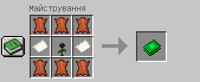

На цій сторінці ви знайдете опис економічної системи серверу

## Які існують види валюти?
- На сервері є три різновиди валюти: Копійки, Ліки і Аури. Шістдесят чотири Копійки дорівнюють одному Ліку, а шістдесят чотири Ліки дорівнюють одному Ауру (від лат. Aurum - золото)

## Що таке гаманець?

- Гаманець - 'магічний' предмет, у якому ви можете зберігати власні кошти на ігровому сервері. Візьміть його в руку і натисніть ПКМ!
- Також гаманець надає можливість конвертувати певні ресурси у ігрову валюту серверу, автоматично оцінюючи їх вартість

## Як отримати гаманець?

:::caution[Обережно!]
Наразі відомо про баг, який може призвести до зникнення речей всередині гаманця. Для вашого ж комфорту, будьте обережні з використанням цього предмету! Не переносьте до вмісту Гаманця предмети, які ви **не** плануєте продавати!
:::

- Його потрібно скрафтити! Для цього вам знадобиться: 6 шкіри, 2 паперу, 1 візер-троянда. Крафт виглядає наступним чином:

     

## Як все ж таки заробляти гроші?

- Для цього існує цікава механіка: оцінка. Обираєте будь-який предмет, і переносите його у вміст Гаманця, бачите оцінку у Копійках, після чого підтверджуєте продаж або відміняєте!