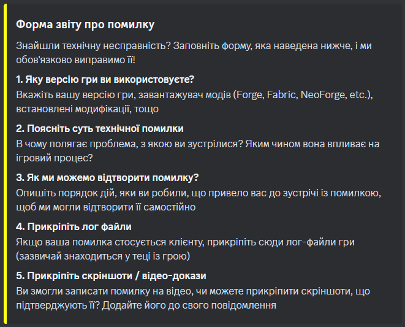

import author from '../../../../assets/emporium/author.png';
import ingame from '../../../../assets/emporium/ingame.png';

На цій сторінці ви знайдете опис такої унікальної механіки серверу, як Емпоріум (від грец. empórion) 

## Що таке Емпоріум?

Емпоріум - власна унікальна механіка серверу, яка надає можливість гравцям заробити бали емпоріуму, і придбати унікальні ("магічні") речі за них. На ігровому сервері виступає окремим меню, де ви можете побачити асортимент предметів в залежності від вашого балансу

## Як отримати бали емпоріуму?

Існує три варіанти отримання балів емпоріуму:

1. Щоб заохочити учасників нашого сервера до створення контенту, пов'язаного з нашим сервером, що в свою чергу принесе користь і популярність, в минулому сезоні була додана механіка Емпоріуму. Все дуже просто: автор контенту робить будь-який вид медіамистецтва, що пов'язане із нашим сервером. Це можуть бути короткі відео в тік-току, стріми на Твічі, відео на Ютубі, тощо; все що містить пряму згадку сервера UAProject і посилання на сервер. За результатами медійності вашої творчості, ви можете отримати певну кількість балів на ігровому сервері, які можете витратити у відповідному меню

2. За репорт багів. Якщо ви виявили баг на сервері, ви можете заробити бали емпоріуму, якщо ви напишете про нього по шаблону у тікет на нашому Discord сервері, і він виявиться дійсним. Щоб отримати шаблон для репорту, відкрийте тікет на нашому Discord сервері, і використайте команду `/bugreport`. Кількість отриманих балів залежить від складності багу/дюпу, а також від його розповсюдженності і декількох інших факторів

3. За виконання своїх обов'язків на ігровій ролі. Якщо це Мі-9 - за розв'язання проблем із порушенням правил; Суддя - за проведення слухань і вирішення справ; тощо

## Я автор контенту. Що мені робити?

- На ігровому сервері - виконати команду /emporium, якщо плануєте брати участь у цьому, щоб зареєструвати свій акаунт

- Викласти відео, провести стрім, зробити нарізку, тощо, вказавши наш сервер у описі. Виконати команду `/emporium` в цьому дискорд сервері, і заповнити анкету, де надати інформацію про свій ігровий нікнейм, кількість балів і підтвердження контенту посиланням

- Чекати поки ваша заявка буде оформлена, і періодично перевіряти ігрове меню на сервері!

    

## Я репортер багів. Що мені робити?

- На ігровому сервері - виконати команду /emporium, якщо плануєте брати участь у цьому, щоб зареєструвати свій акаунт

- Відкрити тікет на нашому Discord сервері, натиснувши на кнопку у каналі #підтримка. Перейти до створеного каналу із номером, виконати команду `/bugreport`, і описати знайдену вразливість за наданим ботом шаблоном

- Чекати поки адміністрація перевірить ваш репорт, і періодично перевіряти ігрове меню на сервері!

  

## Вигляд меню на ігровому сервері

    

## Як передати свої бали іншому гравцю?

- Виконати команду `/emporium transfer <ім'я гравця> <кількість балів>` на ігровому сервері