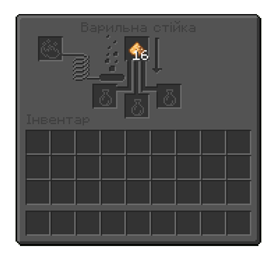
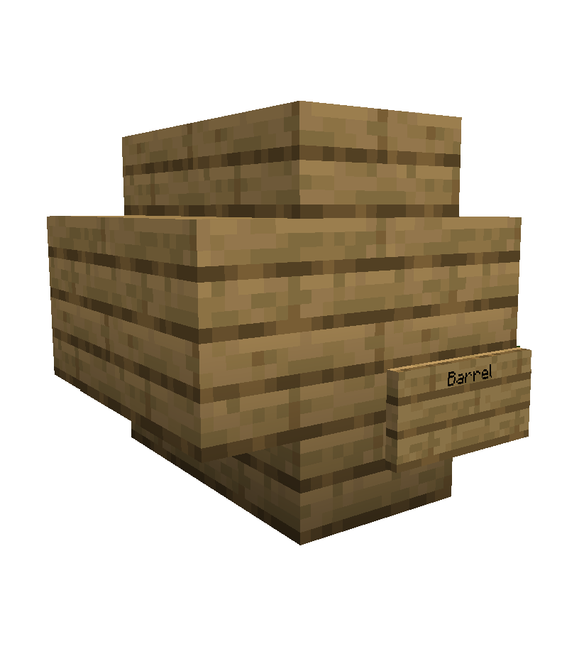
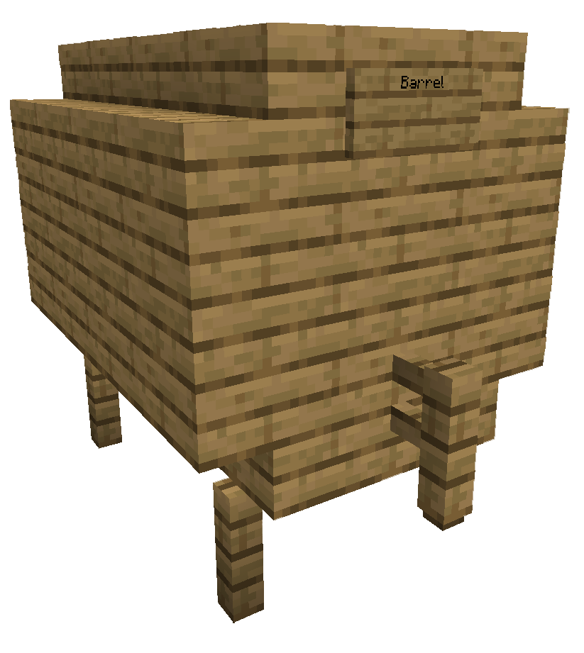

На нашому сервері встановлена система Алкоголю, який ви зможете зварити саморуч й вистояти його до потрібних вам років,
щоб вкусити дорослого життя без шкоди для здоров'я! Ну, майже...

## Бродіння

Спершу вам потрібно побудувати невеличкий механізм де будуть бродити ваші інгредієнти. Для цього нам потрібне вогнище,
відро води й казан.

Тепер ви можете саморуч закидувати свої інгрідієнти в казан. Якщо ви не вгадаєте з часом чи кількістю інгредієнтів
якість напою може опуститись, або ви взагалі зіпсуєте напій, тому будьте пильні та спостерігайте за цим процесом!

## Перегін

Деякі види напоїв можуть потребувати перегону, тож вам потрібно також мати її установку в арсеналі

Для перегонки використовуйте просту зіллєварку, у верхній слот кладіть світло камінь, який виступає фільтром та не
витрачається у процесі, а знизу ваш алкоголь.

## Витримка

На якість напою впливає тип дерева, з якого зроблена діжка. Тож уважно дивіться та підбирайте саме те дерево, яке
потрібне. 1 рік витримки — це 1 доба в грі. До речі пропуск ночі не впливає на час, тому що витримка вираховується у
справжньому пройденому часі.

Для деяких сортів підходить проста діжка, інші ж види потребують середню або велику діжку. Для середньої діжки вам
потрібно 8 сходинок та 1 табличка з надписом “Barrel” англійською мовою

Для великої діжки вам потрібно 16 сходинок, 5 парканів, 1 табличка з надписом “Barrel”, 18 блоків дерева.

## Рецепти

| Напій            | Інгредієнти                                       | Час бродіння | Перегонка   | Витримка  | Дерево      |
|------------------|---------------------------------------------------|--------------|-------------|-----------|-------------|
| Пшеничне Пиво    | 3 пшениці                                         | 8 хвилин     | Не потрібно | 2 дні     | Береза      |
| Смачне Пиво      | 6 пшениці                                         | 8 хвилин     | Не потрібно | 3 дні     | Не потрібно |
| Темне Пиво       | 6 пшениці                                         | 8 хвилин     | Не потрібно | 8 днів    | Темний дуб  |
| Червоне Вино     | 5 солодких ягід                                   | 5 хвилин     | Не потрібно | 20 днів   | Не потрібно |
| Мед              | 6 цукрової тростини                               | 3 хвилини    | Не потрібно | 4 дні     | Дуб         |
| Яблучний Мед     | 6 цукрової тростини, 2 яблука                     | 4 хвилини    | Не потрібно | 4 дні     | Дуб         |
| Сідр             | 14 яблук                                          | 7 хвилин     | Не потрібно | 3 дні     | Не потрібно |
| Яблучний Лікер   | 12 яблук                                          | 16 хвилин    | 3 перегонки | 6 днів    | Акація      |
| Віскі            | 10 пшениці                                        | 10 хвилин    | 2 перегонки | 18 днів   | Ялина       |
| Ром              | 18 цукрової тростини                              | 6 хвилин     | 2 перегонки | 14 днів   | Дуб         |
| Горілка          | 10 картоплі                                       | 15 хвилин    | 3 перегонки | 0 днів    | Не потрібно |
| Грибна Горілка   | 10 картоплі, 3 червоних гриба, 3 коричневих гриба | 18 хвилин    | 5 перегонок | 0 днів    | Не потрібно |
| Джин             | 9 пшениці, 6 блакитних квіток, 1 яблуко           | 6 хвилин     | 2 перегонки | 0 днів    | Не потрібно |
| Мескаль          | 8 кактусів                                        | 15 хвилин    | 2 перегонки | 12 днів   | Береза      |
| Абсент           | 15 трави                                          | 3 хвилини    | 6 перегонок | 80 секунд | Не потрібно |
| Токсичний абсент | 17 трави, 2 отруйні картоплі                      | 5 хвилин     | 6 перегонок | 85 секунд | Не потрібно |
| Картопляний суп  | 5 картоплі, 3 трави                               | 3 хвилини    | Не потрібно | 0 днів    | Не потрібно |
| Кава             | 12 какао-бобів, 2 молока                          | 2 хвилини    | Не потрібно | 0 днів    | Не потрібно |
| Яєчний Лікер     | 5 яєць, 2 цукру, 1 молоко                         | 2 хвилини    | Не потрібно | 3 дні     | Не потрібно |

